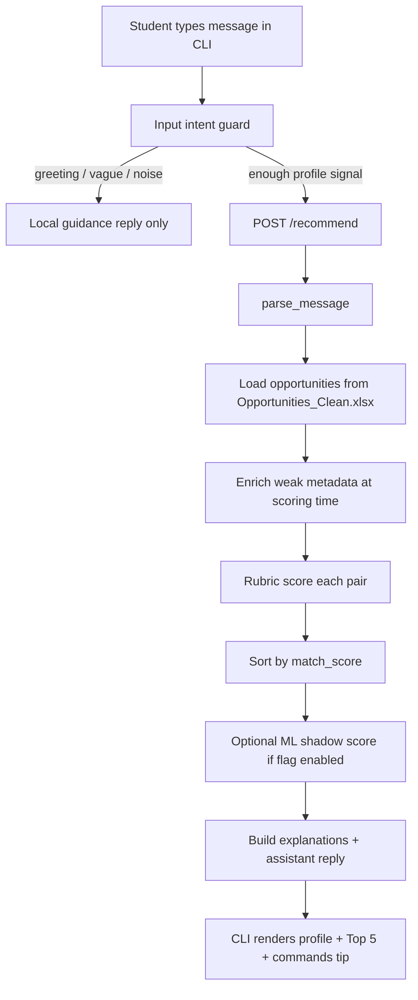

# CareerFinder.ai Terminal CLI README

> **Scope:** This document covers the **terminal/CLI version** of CareerFinder.ai — how to run it, how recommendations work, the ML pipeline, datasets, and techniques. It does **not** document the web frontend as the primary demo path.

---

## 1. Project Overview

**CareerFinder.ai** is a Saudi COOP and internship recommendation system for computing students. A student types a natural-language career request; the system:

1. **Parses** the message into a structured profile (major, city, skills, program type, work mode, roles, interview preference).
2. **Loads** a cleaned opportunity dataset (~173 real listings in the current demo).
3. **Scores** each opportunity with an **explainable rubric** (0–100 match score).
4. **Ranks** and returns the **Top 5** with reasons, matched skills, and missing skills.
5. **Optionally** computes an **ML shadow score** (offline-trained regression model) — ranking always stays rubric-based.

This is a **hybrid AI recommender**: rule-based NLP parsing + deterministic rubric scoring + supervised ML regression for evaluation and optional shadow comparison. It is **not** a custom LLM and does **not** predict admission probability or guarantee internships.

---

## 2. What the Terminal Version Does

The terminal client (`scripts/careerfinder_cli.py`) is an interactive chat that talks to the FastAPI backend (`POST /recommend`).

| Capability | Description |
|---|---|
| Natural-language input | Multi-turn messages accumulate (same as web chat). |
| Parsed profile display | Compact profile block after each recommendation turn. |
| Top 5 table | Rank, match score %, company, program, city, mode, missing skills summary. |
| Assistant reply | Context-aware guidance, role directions, next-best action. |
| `/details N` | Full breakdown: score components, why matched, matched/missing skills, source link. |
| ML introspection | `/metrics`, `/model`, `/shadow`, `/ml` — offline ML results without changing live ranking. |
| Session control | `/reset`, `/clear`, `/undo`, `/history`, `/profile`. |

**Default output mode:** compact table. Use `/verbose` for full recommendation cards or `/split` for side-by-side layout (≥120 columns).

---

## 3. Why the CLI Exists

| Reason | Detail |
|---|---|
| **Primary demo path** | Runs locally with Python stdlib only (CLI) + FastAPI backend. No browser required. |
| **Professor / teammate friendly** | Shows parsing, scores, and explanations in plain terminal text — easy to screen-share or copy into a report. |
| **Same engine as API** | CLI calls `POST /recommend`; behavior matches the web chat when the backend is shared. |
| **ML transparency** | Dedicated commands expose fair-model metrics and rubric-vs-ML comparison without conflating them with live ranking. |
| **No persistent storage** | Session state lives in memory for the terminal session only. |

---

## 4. System Architecture



### Layer summary

| Layer | Module(s) | Role |
|---|---|---|
| **CLI** | `scripts/careerfinder_cli.py` | UX, commands, formatting, backend HTTP calls |
| **API** | `backend/app/main.py` | `/health`, `/parse`, `/recommend` |
| **Intent** | `backend/app/input_intent.py` | Skip weak rankings for greetings, noise, discovery-only input |
| **Parser** | `backend/app/parser.py` | NL → `ParsedProfile` |
| **Taxonomy** | `backend/app/taxonomy.py` | Aliases for cities, skills, interests, work modes |
| **Data** | `backend/app/recommender.py` | Load `Opportunities_Clean.xlsx`, candidate pool |
| **Enrichment** | `backend/app/opportunity_enrichment.py` | Infer weak role/skill signals when dataset metadata is thin |
| **Rubric** | `backend/app/rubric.py`, `scoring.py` | Component scores → `match_score` (0–100) |
| **ML shadow** | `backend/app/ml_scoring.py` | Optional `ml_score` from `fair_gradient_boosting_model.joblib` |
| **Explanation** | `recommendation_explanation.py`, `assistant_reply.py` | Human-readable why / next action |

---

## 5. Terminal Demo Flow

Typical presentation flow:

1. Start backend → start CLI → choose **guest** (option 1).
2. `/help` — show command list.
3. Vague input: `I want an internship` → **role guidance** (no Top 5 yet).
4. Full profile message → **profile + Top 5 + assistant reply**.
5. `/details 1` — deep dive on rank #1.
6. `/ml` or `/metrics` — explain ML is shadow-only; rubric drives ranking.
7. `/open 1` or `/links` — show verified source URLs.
8. `/reset` — clear session for next demo participant.

---

## 6. How to Run

### Option A — Manual (two terminals)

**Terminal 1 — Backend** (from `career-finder-ai/backend`):

```powershell
cd career-finder-ai\backend
python -m uvicorn app.main:app --reload --host 127.0.0.1 --port 8000
```

**Terminal 2 — CLI** (from `career-finder-ai/`):

```powershell
cd career-finder-ai
python scripts\careerfinder_cli.py
```

Alternative from repo root:

```powershell
python -m uvicorn app.main:app --reload --host 127.0.0.1 --port 8000 --app-dir backend
python scripts/careerfinder_cli.py
```

### Option B — npm launcher (Windows)

From `career-finder-ai/`:

```powershell
npm.cmd run run:terminal
```

This PowerShell script (`scripts/run-terminal.ps1`):

- Checks `GET http://127.0.0.1:8000/health`
- Starts the backend in a **new window** if needed
- Opens the CLI in another **new window**

### Environment variables

| Variable | Default | Purpose |
|---|---|---|
| `CAREERFINDER_API_BASE` | `http://127.0.0.1:8000` | Backend URL for CLI |
| `CAREERFINDER_ENABLE_ML_SCORE` | unset (disabled) | Set to `true` to attach optional `ml_score` on `/recommend` responses |

---

## 7. Required Setup

| Requirement | Notes |
|---|---|
| **Python 3.11+** | Backend and CLI |
| **Backend dependencies** | `pip install -r backend/requirements.txt` (includes FastAPI, pandas, scikit-learn, joblib for ML scripts) |
| **Dataset file** | `data/processed/Opportunities_Clean.xlsx` (173 opportunities in current demo) |
| **ML metrics CSVs** | Pre-generated under `data/processed/` for `/metrics` and `/shadow` |
| **ML model artifact** | `models/fair_gradient_boosting_model.joblib` — **gitignored**; required only if enabling ML shadow scoring. Metrics still work from CSV without the `.joblib` file. |
| **Node.js** | Only for `npm run run:terminal` launcher — not required for direct `python scripts/careerfinder_cli.py` |

---

## 8. Main CLI Commands

| Command | Description |
|---|---|
| `/help` | Full command list |
| `/profile` | Show current parsed profile (verbose) |
| `/details N` | Score breakdown, why matched, skills, source link for rank N |
| `/top [N]` | Re-print compact Top N (default 5) |
| `/open N` | Open rank N source URL in browser |
| `/links` | All ranked source URLs |
| `/history` | Numbered list of remembered user messages |
| `/undo` | Remove last message and rerun if messages remain |
| `/reset`, `/home` | Clear session and return to welcome screen |
| `/clear` | Clear screen only (keeps session) |
| `/compact`, `/verbose`, `/split` | Output modes |
| `/metrics` | Fair + rubric-assisted ML metrics from CSV |
| `/model` | ML shadow status (ranking stays rubric) |
| `/shadow` | Rubric vs ML comparison summary |
| `/ml` | Combined ML status + best fair model quick stats |
| `/login`, `/guest` | Auth placeholders (no real persistence) |
| `/exit` | Quit |

**Accidental input guard:** Empty input, single letters (`n`, `y`), and typos like `/n` are rejected locally — they never hit the backend.

---

## 9. Example Full Demo

**Input:**

```text
I am a CS student in Khobar looking for cybersecurity COOP. I know SQL, MongoDB, Linux, networking, and SIEM. I prefer on-site and I want an interview. I want to work in Security Operations.
```

**Observed CLI output (verified run, June 2026):**

### Parsed profile

| Field | Value |
|---|---|
| Major | CS |
| City | Khobar |
| Interest | Cybersecurity |
| Program type | COOP |
| Work mode | On-site |
| Skills | sql, linux, networking, cybersecurity, siem, mongodb |
| Preferred roles | Security Operations |
| Interview pref. | Interview preferred |

### Assistant (summary)

- Strong match found.
- Top match: **Bank Albilad — Cooperative Training Program, 86%**
- Next action: Strengthen **python, apis, git** for this role direction.
- Role directions: Cybersecurity Operations 100%, Security Engineering 100%, Backend Engineering 62%, …

### Top 5 (compact)

| Rank | Score | Company | Program | City | Mode |
|---:|---:|---|---|---|---|
| 1 | 86% | Bank Albilad | Cooperative Training Program | Saudi Arabia | In person |
| 2 | 84% | Saudi Food & Drug Authority (SFDA) | COOP training | Saudi Arabia | In person |
| 3 | 84% | Al Rajhi Takaful | Cooperative Training | Riyadh | In person |
| 4 | 84% | NHC | COOP Trainee | Saudi Arabia | In person |
| 5 | 82% | HungerStation | Co-OP Trainee, Data Analytics | Riyadh | In person |

**Scanned:** 173 opportunities.

### Vague input behavior

**Input:** `I want an internship`

**Result:** Role guidance menu (Analyst / Engineer / Security / Infrastructure / AI-Data) — **no Top 5**, no backend recommend call until enough profile signal exists.

---

## 10. Parsed Profile Explanation

The parser (`backend/app/parser.py`) extracts:

| Field | Technique |
|---|---|
| **Major** | Keyword map: "computer science" → CS, "cybersecurity" → CYS, etc. |
| **University** | Known Saudi university names and abbreviations |
| **City / locations** | Primary city, home city, preferred/acceptable locations, flexibility via `taxonomy.CITY_ALIASES` |
| **Skills** | Token scan + `SKILL_ALIASES` normalization; overlap with qualifications filtered |
| **Interest** | Text interest from `INTEREST_ALIASES` overrides major-default interest |
| **Program type** | COOP / Internship / Training patterns |
| **Work mode** | On-site / Remote / Hybrid normalization |
| **Preferred roles** | Explicit job titles + cluster fallback from interest |
| **Interview preference** | "want an interview", "in person interview", etc. |

Multi-turn messages are **joined with newlines** before parsing — later turns refine the same profile.

---

## 11. Recommendation Output Explanation

Each recommendation includes:

| Field | Meaning |
|---|---|
| `match_score` | Rubric fit 0–100 (integer % in CLI) |
| `score_source` | Always `rubric` for live ranking |
| `ml_score` | Optional shadow score (only if flag + model artifact) |
| `role_cluster` | Inferred role bucket (e.g. Cybersecurity, Software Engineering) |
| `skills_matched` | Student skills found in opportunity requirements/metadata |
| `missing_skills` | Recommended skills not yet in student profile |
| `why_recommended` | Bullet reasons (major, interest, skills, location, program, mode, source) |
| `score_breakdown` | Per-component rubric scores (shown in `/details`) |
| `source_url` | Verified link when available |

The assistant reply (`assistant_reply.py`) adds:

- Match strength headline
- Top match one-liner
- **Next best action** (concrete skill gaps)
- **Possible role directions** from role-family inference

---

## 12. Score Meaning

**`match_score` is a recommendation fit score**, not:

- ❌ Probability of acceptance
- ❌ Admission chance
- ❌ HR hiring decision

**It means:** How well this opportunity aligns with the parsed student profile across rubric dimensions (major, skills, role interest, location, program type, work mode, source confidence, interview preference).

Scale: **0–100**, displayed as **percentages** in the CLI (e.g. 86%).

---

## 13. Why Scores Are Conservative

Design choices that keep scores honest and explainable:

1. **Partial credit, not binary** — Missing skills reduce the skill component; generic COOP listings with thin metadata score lower on skills.
2. **Broad location penalty** — "Saudi Arabia" listings match broadly (~0.5 city component) rather than exact Khobar match (1.0).
3. **No score inflation** — Rubric weights are fixed; there is no calibration to force high scores.
4. **Enrichment is weak signal** — Inferred skills from company/title text add partial weight only; explicit `skills_list` wins.
5. **Intent guard** — Vague profiles get guidance instead of misleading Top 5 lists.
6. **Missing skills surfaced** — Top matches often show 70–86% with explicit gaps (python, apis, git, soc) rather than claiming perfect fit.

---

## 14. Dataset Resources Used

### Live recommender

| File | Role |
|---|---|
| `data/processed/Opportunities_Clean.xlsx` | Primary opportunity pool (~173 rows) |
| `data/processed/Opportunities_Enriched.csv` | Enriched export (optional reference; runtime enrichment in code) |

### Opportunity fields used

- Company, program title, city, work mode, program type
- `major_fit`, `requirements`, `skills_list`, `source_url`
- Verification / interview signals inferred at scoring time

### Regression / ML artifacts

| File | Role |
|---|---|
| `student_opportunity_regression_dataset.csv` | 8,304 labeled profile–opportunity pairs |
| `regression_train_split.csv` | 6,574 train rows |
| `regression_test_split.csv` | 1,730 test rows |
| `regression_split_summary.json` | Split metadata |
| `regression_split_profile_ids.csv` | Which profiles are in train vs test |
| `fair_regression_model_metrics.csv` | Fair track metrics |
| `rubric_assisted_regression_model_metrics.csv` | Leakage demo metrics |
| `rubric_vs_ml_summary.json` | Rubric vs ML comparison |
| `fair_model_error_analysis.csv` | Per-row error analysis |
| `report_recommendation_examples.csv` | Course report examples |

---

## 15. ML Resources Used

### Trained models (generated by training scripts; `.joblib` gitignored)

| Artifact | Track | Purpose |
|---|---|---|
| `models/fair_gradient_boosting_model.joblib` | Fair (A) | **Best fair model** — optional live shadow scoring |
| `models/fair_random_forest_model.joblib` | Fair | Comparison |
| `models/fair_ridge_model.joblib` | Fair | Baseline |
| `models/rubric_assisted_*.joblib` | Rubric-assisted (B) | Leakage demo only — **do not report as honest ML** |

### Reports

| Document | Content |
|---|---|
| `docs/reports/ml_results_summary.md` | Course-ready ML summary |
| `docs/reports/model_metrics_summary.md` | Full metrics table both tracks |
| `docs/reports/rubric_vs_ml_comparison.md` | ML-5 comparison analysis |
| `docs/reports/example_recommendations.md` | Worked examples with target vs predicted |

### Training scripts (run from `backend/`)

```powershell
python -m app.build_regression_dataset
python -m app.inspect_regression_split
python -m app.train_fair_regression_model
python -m app.compare_regression_models
```

---

## 16. ML Problem Formulation

| Aspect | Definition |
|---|---|
| **Task** | Supervised **regression** |
| **Input** | Synthetic student profile + real opportunity metadata (text + categoricals) |
| **Label (`target_score`)** | Rubric weighted sum 0–100 from `app.rubric.compute_target_score` |
| **Goal** | Learn to **predict rubric fit** from profile/opportunity features **without** feeding rubric components as inputs (fair track) |
| **Not the goal** | Predict hire/acceptance; replace live ranking without validation |

Each row in `student_opportunity_regression_dataset.csv` is one `(profile_id, opportunity_id)` pair with ~48 synthetic profiles × ~173 opportunities ≈ **8,304 rows**.

---

## 17. Regression Dataset Creation

Script: `backend/app/build_regression_dataset.py`

1. **Build synthetic profiles** — 48 curated personas (CS backend Riyadh, eastern-province CYS, DS Jeddah, etc.) with realistic `chat_message` text.
2. **Cross product with opportunities** — Every profile paired with every loaded opportunity.
3. **Score with rubric** — Same logic as live recommender → eight component scores + `target_score`.
4. **Enrich opportunity signals** — Adds inferred role cluster, interests, required/preferred skills columns for analysis.
5. **Write CSV** — `data/processed/student_opportunity_regression_dataset.csv`

The label is **rubric-generated**, not from user clicks or hiring outcomes.

---

## 18. Train/Test Split

| Parameter | Value |
|---|---|
| Method | `GroupShuffleSplit` by **`profile_id`** |
| Train rows | **6,574** (~79.2%) |
| Test rows | **1,730** (~20.8%) |
| Total profiles | **48** |
| Train profiles | **38** |
| Test profiles | **10** |
| Profile overlap | **None** — no `profile_id` in both splits |
| Random state | 42 |

**Why profile-based split matters:** If the same student's rows appeared in both train and test, the model could memorize profile-specific patterns and **inflate metrics** (profile leakage). Grouping by `profile_id` ensures the model generalizes to **unseen student personas**.

Artifacts: `regression_train_split.csv`, `regression_test_split.csv`, `regression_split_summary.json`.

---

## 19. Models Used

### Track A — Fair (leakage-safe, **report these**)

Features: profile/opportunity **text + categoricals + count features only**. Rubric component columns **excluded**.

| Model | Notes |
|---|---|
| `fair_ridge` | Linear baseline + TF-IDF pipeline |
| `fair_random_forest` | Non-linear ensemble |
| **`fair_gradient_boosting`** | **Best fair model** — selected by lowest MAE |

### Track B — Rubric-assisted (leakage demo, **do not report as honest**)

Features include the same eight rubric components used to build `target_score`. Any regressor can nearly reconstruct the label (MAE ≈ 0.02, R² ≈ 1.0) — useful sanity check only.

---

## 20. Evaluation Metrics

| Metric | Meaning in this project |
|---|---|
| **MAE** (Mean Absolute Error) | Average \|predicted − target_score\| in points on 0–100 scale. Lower is better. **5.834** ≈ typical off-by ~6 points. |
| **RMSE** (Root Mean Squared Error) | Penalizes large errors more than MAE. **7.265** on fair GB. |
| **R²** (Coefficient of determination) | Fraction of variance in `target_score` explained. **0.648** = moderate fit; room remains because fair inputs lack rubric components. |
| **Precision@k** | Fraction of top-k predictions where target_score ≥ 70 (relevance threshold). ~20–27% on fair track — ranking overlap with rubric top-k is limited. |
| **Pearson / Spearman correlation** | Linear / rank correlation between rubric and ML predictions on test split. |
| **Top-5 overlap** | Average Jaccard-like overlap of rubric top-5 vs ML top-5 per test profile. |

---

## 21. Final ML Results

**Best fair model (confirmed from `fair_regression_model_metrics.csv` and `rubric_vs_ml_summary.json`):**

| Metric | Value |
|---|---|
| Model | `fair_gradient_boosting` |
| MAE | **5.834** |
| RMSE | **7.265** |
| R² | **0.648** |
| Precision@1 | 20.0% |
| Precision@3 | 26.7% |
| Precision@5 | 24.0% |
| Train rows | 6,574 |
| Test rows | 1,730 |
| Train profiles | 38 |
| Test profiles | 10 |

**Rubric-assisted best (leakage demo only):** `rubric_assisted_ridge` — MAE 0.023, R² 1.000 — **not honest generalization**.

---

## 22. Rubric vs ML Comparison

From `data/processed/rubric_vs_ml_summary.json`:

| Metric | Value |
|---|---|
| Rows compared | 1,730 |
| Profiles compared | 10 |
| Mean absolute difference | 5.834 |
| Median absolute difference | 5.280 |
| Max absolute difference | 25.709 |
| Pearson correlation | 0.833 |
| Spearman correlation | 0.784 |
| Average top-5 overlap | 0.360 |

**Interpretation:**

- Scores **correlate moderately well** (r ≈ 0.83) — ML captures broad fit patterns.
- **Top-5 lists diverge often** (36% average overlap) — ML would reorder the shortlist if used for ranking.
- **Recommendation:** keep rubric primary; use ML as **shadow score** first.

---

## 23. Why Rubric Is Primary in Live CLI

| Reason | Explanation |
|---|---|
| **Stability** | Deterministic weights; same profile + opportunity → same score every time. |
| **Explainability** | `/details` shows each component (major, skills, location, …). |
| **Product alignment** | Assistant copy and `score_breakdown` are built from rubric components. |
| **No outcome labels** | ML was trained to predict rubric scores, not hiring results — not validated for ranking replacement. |
| **Limited top-k overlap** | 36% top-5 overlap on hold-out profiles is insufficient evidence to switch ranking. |
| **Fair model uncertainty** | MAE ~5.8 points and R² 0.65 mean ML does not replicate rubric exactly. |

Live behavior:

- **Sort key:** `match_score` (rubric)
- **ML:** Optional `ml_score` when `CAREERFINDER_ENABLE_ML_SCORE=true` and model artifact present — **does not change sort order**

---

## 24. Techniques Used

### 24.1 Natural-language parsing

Rule-based extraction (no LLM):

- **Major extraction** — Regex/keyword maps to codes (CS, CYS, DS, …)
- **City extraction** — `CITY_ALIASES`: `alkhobar`, `al khobar` → Khobar; Eastern Province cluster (Dammam, Khobar, Dhahran)
- **Skill extraction** — Delimiter-aware lists; alias folding via `SKILL_ALIASES`
- **Program type** — COOP / co-op / cooperative training → `COOP`; internship patterns → `Internship`
- **Work mode** — on-site / in person / onsite → `On-site`; remote; hybrid
- **Interview preference** — "want an interview" → `Interview preferred`
- **Preferred role** — Title patterns + interest cluster seeding (e.g. Cybersecurity → SOC Analyst cluster)

### 24.2 Taxonomy and aliases

Centralized in `taxonomy.py` so parser and rubric agree.

| User says | Normalized to |
|---|---|
| cyber, infosec, SOC, SIEM | Cybersecurity interest / skills |
| co-op, cooperative training | COOP |
| on-site, in person, onsite | On-site |
| k8s | kubernetes |
| dev ops | devops |

### 24.3 Dataset loading and enrichment

- **Load:** pandas reads `Opportunities_Clean.xlsx`
- **Enrichment (runtime):** `opportunity_enrichment.py` infers role cluster, interests, skills from company/title/requirements when explicit fields are weak
- **Verification:** Source URL presence boosts confidence score
- **Skill fields:** `skills_list`, `requirements`, plus inferred required/preferred skills by role profile

### 24.4 Rubric-based recommendation

Weighted components (`TARGET_WEIGHTS` in `rubric.py`):

| Component | Weight |
|---|---|
| Major fit | 35% |
| Skill match | 20% |
| Role/interest fit | 15% |
| City/location fit | 10% |
| Program type fit | 10% |
| Work mode fit | 5% |
| Source confidence / verification | 3% |
| Interview preference fit | 2% |

Combined → `target_score` 0–100 → exposed as `match_score`.

### 24.5 ML regression

1. Synthetic profile × opportunity pairs
2. Label = rubric `target_score`
3. Fair split by `profile_id`
4. Features: TF-IDF text + one-hot categoricals + counts (fair GB pipeline)
5. Models: Ridge, Random Forest, Gradient Boosting
6. Metrics: MAE, RMSE, R², Precision@k

### 24.6 Recommendation explanation

- Template-based **why** lines from score components
- **Matched / missing skills** from rubric skill overlap logic
- **Conservative language** — "strong / partial / broad" fit labels
- **Next best action** — top missing skills for student's stated interest

### 24.7 CLI interaction

- Commands for inspect, undo, history, ML introspection
- Loading spinner before backend call
- Score-change notes when profile evolves across turns
- Accidental-input and greeting guards

---

## 25. Files and Folder Structure

```
career-finder-ai/
├── scripts/
│   ├── careerfinder_cli.py      # Terminal client (main demo)
│   └── run-terminal.ps1         # Windows launcher for npm run:terminal
├── backend/app/
│   ├── main.py                  # FastAPI /recommend endpoint
│   ├── parser.py                # NL parsing
│   ├── input_intent.py          # Recommend vs guidance gate
│   ├── recommender.py           # Load data, rank, respond
│   ├── rubric.py                # Scoring logic + target_score
│   ├── scoring.py               # Legacy/alternate score helpers
│   ├── taxonomy.py              # Aliases and role clusters
│   ├── opportunity_enrichment.py
│   ├── ml_scoring.py            # Optional shadow ML scores
│   ├── assistant_reply.py       # Assistant message builder
│   ├── recommendation_explanation.py
│   ├── build_regression_dataset.py
│   ├── train_fair_regression_model.py
│   └── schemas.py               # Pydantic models
├── data/processed/
│   ├── Opportunities_Clean.xlsx
│   ├── student_opportunity_regression_dataset.csv
│   ├── regression_*_split.csv
│   └── *_metrics.csv, rubric_vs_ml_summary.json
├── models/                      # .joblib artifacts (gitignored)
├── docs/
│   ├── README_TERMINAL.md       # This file
│   └── reports/                 # ML summaries and demo scripts
└── tests/
    ├── test_parser.py
    ├── test_recommender.py
    ├── test_cli_ml_commands.py
    └── ...
```

---

## 26. Testing and QA

**Verification suite (run from `career-finder-ai/`):**

```powershell
python -m pytest tests/test_parser.py tests/test_recommender.py tests/test_input_robustness.py tests/test_assistant_reply.py tests/test_cli_ml_commands.py -q
```

**Last verified:** 225 passed (June 2026 documentation run).

Additional test modules: `test_scoring.py`, `test_regression_dataset.py`, `test_fair_regression_training.py`, `test_rubric_vs_ml_comparison.py`, `test_recommendation_explanation.py`.

**Smoke script:** `python scripts/final_demo_smoke.py` — automated demo path without manual typing.

**Manual QA checklist:**

- [ ] `/help` lists ML commands
- [ ] Vague input → guidance only
- [ ] Full profile → Top 5 with scores and missing skills
- [ ] `/details 1` → breakdown + source link
- [ ] `/metrics` → fair MAE 5.834 when CSV present
- [ ] `/reset` clears session

---

## 27. Known Limitations

| Limitation | Detail |
|---|---|
| **No hire outcome data** | Labels are rubric scores, not acceptance feedback. |
| **Synthetic ML profiles** | 48 personas — not live user traffic distribution. |
| **Small test profile set** | 10 hold-out profiles — top-k overlap statistic has high variance. |
| **Model artifact optional** | `.joblib` not in git; shadow scoring requires local training or copy. |
| **Generic listings** | Many COOP programs lack detailed skill metadata — scores stay conservative. |
| **City granularity** | National "Saudi Arabia" listings cannot match Khobar exactly. |
| **No guarantee** | Recommendations are suggestions; students must verify eligibility on source sites. |
| **Auth stub** | `/login` does not persist profiles to a database. |
| **Frontend separate** | This README does not cover Next.js UI behavior. |

---

## 28. Troubleshooting

| Problem | Solution |
|---|---|
| `Backend is not running` | Start uvicorn on port 8000; check firewall |
| `Cannot reach backend` | Set `CAREERFINDER_API_BASE` if not using localhost:8000 |
| Port 8000 in use | Stop other process or change port + update env var |
| No recommendations / empty pool | Confirm `data/processed/Opportunities_Clean.xlsx` exists |
| `/metrics` file not found | Run ML training scripts or use committed CSVs in `data/processed/` |
| ML score: not available | Expected when `CAREERFINDER_ENABLE_ML_SCORE` unset or `.joblib` missing |
| `ModuleNotFoundError` | Activate venv; `pip install -r backend/requirements.txt` |
| PowerShell `&&` error | Use `;` between commands or run from correct directory separately |
| Accidental input message | Type full sentence or valid `/command` |
| Split mode fallback | Terminal < 120 columns → auto compact view |

---

## 29. Suggested Demo Script for Presentation

**Opening (30 sec):**  
"CareerFinder.ai helps Saudi computing students find COOP and internships. The terminal demo shows how we parse natural language, score opportunities with an explainable rubric, and optionally compare an ML shadow model."

**Step 1 — `/help`**  
Show commands; emphasize `/details` and `/ml`.

**Step 2 — Vague query**  
`I want an internship` → explain intent guard and role guidance.

**Step 3 — Full profile**  
Use the Khobar cybersecurity COOP example from Section 9. Point out:

- Parsed fields
- 86% top match (fit, not admission chance)
- Missing skills honesty

**Step 4 — `/details 1`**  
Walk through score breakdown and source link.

**Step 5 — ML transparency**  
`/ml` → "Live ranking is rubric; ML is trained offline to predict rubric scores; we keep rubric primary because it's stable and explainable."

**Step 6 — `/open 1`**  
Show verified employer URL.

**Closing Q&A prep:**

- *Is this an LLM?* → No; rule parser + rubric + classical ML regression.
- *Does ML rank results?* → No by default; optional shadow only.
- *What does 86% mean?* → Profile–opportunity alignment, not acceptance probability.

Full walkthrough also in `docs/reports/final_demo_script.md`.

---

## 30. Short Technical Summary for Report

> CareerFinder.ai is a hybrid recommender for Saudi COOP/internship opportunities. Students describe themselves in natural language; a **rule-based parser** extracts structured profiles using a shared **taxonomy** of aliases. The live system loads **173 cleaned opportunities** and ranks them with a **weighted rubric** (major 35%, skills 20%, role interest 15%, location 10%, program 10%, work mode 5%, verification 3%, interview 2%) producing an explainable **match_score (0–100)**. A separate **ML regression pipeline** builds **8,304 profile–opportunity training pairs** from 48 synthetic personas labeled with the same rubric; a **profile-grouped train/test split** (6,574 / 1,730 rows; 38 / 10 profiles) prevents leakage. The best **fair Gradient Boosting** model achieves **MAE 5.834**, **RMSE 7.265**, **R² 0.648**, and **0.833 Pearson correlation** with rubric scores, but only **36% top-5 overlap** — so the **CLI and API keep rubric ranking primary** and treat ML as an optional **shadow score** for analysis. The **terminal CLI** is the recommended demo path: it calls `POST /recommend`, displays Top 5 results, supports `/details` for transparency, and exposes ML metrics via `/metrics` and `/shadow` without conflating them with live behavior.

---

## Verification Commands

Run these to verify the project after setup or changes.

### Backend tests

From `career-finder-ai/`:

```powershell
python -m pytest tests/test_parser.py tests/test_recommender.py tests/test_input_robustness.py tests/test_assistant_reply.py tests/test_cli_ml_commands.py -q
```

### Backend server

From `career-finder-ai/backend/`:

```powershell
python -m uvicorn app.main:app --reload --host 127.0.0.1 --port 8000
```

Or from repo root:

```powershell
python -m uvicorn app.main:app --reload --host 127.0.0.1 --port 8000 --app-dir backend
```

### Terminal CLI

From `career-finder-ai/` (backend must be running):

```powershell
python scripts/careerfinder_cli.py
```

Or:

```powershell
npm.cmd run run:terminal
```

### Frontend checks (optional — not required for terminal demo)

From `career-finder-ai/frontend/`:

```powershell
npm.cmd run lint
npm.cmd run build
```

### Enable ML shadow scoring (optional)

```powershell
$env:CAREERFINDER_ENABLE_ML_SCORE = "true"
python scripts/careerfinder_cli.py
```

Requires `models/fair_gradient_boosting_model.joblib` (train with `python -m app.train_fair_regression_model` from `backend/`).

---

*Document generated from live CLI verification and repository artifacts. Metrics values are taken from committed CSV/JSON files under `data/processed/`.*
