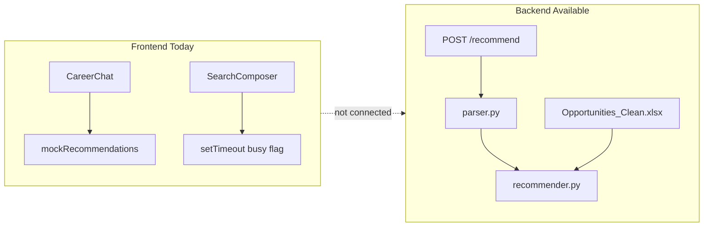

# CareerFinder.ai Chat/Search Recommendation Audit

**Audit date:** 2026-05-03  
**Scope:** `career-finder-ai/frontend`, `career-finder-ai/backend`, `career-finder-ai/database`, `career-finder-ai/tests`

---

## 1. Executive Summary

The project has a **solid FastAPI backend** with rule-based parsing, weighted scoring, filtering, and ranking, backed by **cleaned Excel data** (with a **placeholder fallback**). The **Next.js frontend** is visually rich (chat shell, side shelves, search composer) but is **not wired to the API**: chat uses **timers and mock data**, search **does not fetch or display opportunities**, and types only partially match backend responses.

**Navbar:** `Home`, `Chat`, `Search`, `Methodology`, and **Login** are already the primary nav items; **`Dashboard` and `Model` are not linked in the navbar**—they exist only as **placeholder routes** (`/dashboard`, `/model`). No code removal is required for “hiding” them beyond optionally updating docs and guarding direct URL access later.

**Highest-impact next step:** Define a single **frontend-ready recommendation DTO** (shared by chat and search), extend the backend response to include **match percentage, fit labels, cautions, missing skills, score breakdown, and verification metadata**, then replace mock chat/search flows with that contract. Shelves should eventually reflect **real recommendations or explicit user pins**, not static demo tiles mixed with unclear semantics.

---

## 2. Current Frontend Structure

| Area | Details |
|------|---------|
| **Framework** | **Next.js 16** (App Router), **React 19**, **Tailwind CSS 4**, **Framer Motion**, **shadcn/radix-style UI** (`frontend/package.json`). |
| **App layout** | Root layout and pages under `frontend/src/app/`. |
| **Career shell** | `(career)/layout.tsx` wraps chat/search with `CareerRouteShell` + `CareerShellGrid` (`frontend/src/components/career/career-route-shell.tsx`, `career-shell-grid.tsx`). |
| **Global nav** | `frontend/src/components/layout/navbar.tsx` — items: `/`, `/chat`, `/search`, `/methodology`; **login** opens `login-card-dialog.tsx` (not full auth). |
| **Types** | `frontend/src/lib/types.ts` — `StudentProfile`, `Recommendation`, `RecommendRequest`, `CareerFitMemory`. |
| **Mock data** | `frontend/src/data/mock-recommendations.ts`, `demo-shelf-memories.ts`, `example-prompts.ts`, `search-filter-options.ts`. |

**Routes (selected):**

| Path | File | Role today |
|------|------|------------|
| `/` | `src/app/page.tsx` → `home-page.tsx` | Marketing / entry to chat or search |
| `/chat` | `src/app/(career)/chat/page.tsx` | Renders `CareerChat` |
| `/search` | `src/app/(career)/search/page.tsx` | **Empty placeholder** (no results UI) |
| `/methodology` | `src/app/methodology/page.tsx` | Methodology content |
| `/dashboard` | `src/app/dashboard/page.tsx` | **Placeholder** (not in navbar) |
| `/model` | `src/app/model/page.tsx` | **Placeholder** (not in navbar) |

---

## 3. Current Backend Structure

| Area | Details |
|------|---------|
| **Framework** | **FastAPI** (`backend/app/main.py`). |
| **Entry** | `uvicorn app.main:app` per `main.py` docstring. |
| **Recommender** | `backend/app/recommender.py` — `parse_message` → `filter_candidates` → `compute_score` → rank; `recommend_from_message` builds `RecommendResponse`. |
| **Scoring** | `backend/app/scoring.py` — weighted composite: major, city, work mode, program type, interest, skills, verified URL bonus. |
| **Parser** | `backend/app/parser.py` — rule-based extraction (no LLM in path). |
| **Schemas** | `backend/app/schemas.py` — `ParseRequest`, `RecommendRequest`, `ParsedProfile`, `Opportunity`, `RecommendResponse`, etc. |
| **Data loading** | **Primary:** `pandas.read_excel` on `career-finder-ai/data/processed/Opportunities_Clean.xlsx` (sheet `opportunities_clean` or first sheet). **Fallback:** in-memory `PLACEHOLDER_OPPORTUNITIES` in `recommender.py`. |
| **Database helpers** | `backend/app/database.py` — SQLite connection + `init_db`; **not used** by `/recommend` candidate loading today. |
| **Tests** | `career-finder-ai/tests/` — `test_parser.py`, `test_scoring.py`, `test_recommender.py`. |

**HTTP endpoints (current):**

- `GET /health` — health check  
- `GET /stats` — **placeholder** counts/labels (not derived from live DB)  
- `POST /parse` — returns `ParsedProfile`  
- `POST /recommend` — body `{ "message": "..." }`; returns `profile`, `recommendations`, `total_candidates`

There is **no** `POST /api/chat/recommend` or `GET /api/search/opportunities` yet (no `/api` prefix on routes).

---

## 4. Current Data Flow

- **Chat:** User message → local state → after fixed delays, assistant bubbles → **one** mock `Recommendation` rotated from `mockRecommendations` (`frontend/src/components/chat/career-chat.tsx`). **No** `fetch` to `/parse` or `/recommend`.  
- **Search:** Tokens + free text → `submitSearch` only toggles busy state and clears query after ~1.1s (`search-composer.tsx`). **No** API call, **no** result list.  
- **Shelf:** `CareerFitMemory[]` = **six demo cards** from mock data (`demo-shelf-memories.ts`) **plus** user-“finalized” items derived from chat mock recommendations (`fit-shelf-layout.ts` `buildAllShelfCardsOldestFirst`).

---

## 5. Current Recommendation Card Structure

### Backend (`schemas.py` → `Opportunity`)

Present today: `id`, `rank`, `company`, `title`, `city`, `work_mode`, `program_type`, `major_fit`, `requirements`, `skills_list`, `source_url`, `score` (0–1), `why_recommended` (list of strings), `skills_matched` (list).

**Missing vs. desired shelf/modal contract:** stable string IDs (`recommendation_id`, `opportunity_id`, `company_id`), `match_percentage` / explicit `fit_level` enum/label, `matched_reasons` vs. single list (could alias), `missing_requirements` / `missing_skills`, `suggested_certifications`, `cautions`, `region`, `source_type`, `verification_level`, `score_breakdown`, `is_bookmarked`, `generated_from_query`, `created_at`, sector/company filters.

### Frontend (`types.ts` → `Recommendation`)

Present: `rank`, `companyName`, `programName`, `city`, `programType`, `workMode`, `fitLevel`, `scorePercent`, `matchedSkills`, `whyRecommended` (single string), `sourceUrl`, optional `sourceLabel`.

**Gap:** Field names and shape **do not match** backend (`company` vs `companyName`, `why_recommended` list vs string, no breakdown, no verification).  
**`RecommendationCard`** (`frontend/src/components/recommendations/recommendation-card.tsx`) implements a fuller card UI but is **not imported** elsewhere — **unused**. Chat uses **`ActiveFinalizedFitCard`** instead.

### Shelf tiles (`CareerFitMemory`)

Compact: `id`, `title`, `matchConfidence`, `tags`, `shortReason`, `detailText`. Suitable as a **derived view** of a full recommendation, not a source of truth.

---

## 6. Problems Found

1. **Frontend and backend are disconnected** — no env base URL, no API client, no loading/error handling for recommend.  
2. **Chat is a demo simulator** — “finalize after N turns” bears no relation to parsing or scoring (`assistantsRemaining` / `finalizeGateOpen` in `career-chat.tsx`).  
3. **Search page is empty** — no grid, no pagination, no shared card component wired to data.  
4. **Duplicate/contradictory product semantics** — shelves show **static demo** tiles (`DEMO_SHELF_GLOBAL_SIX`) unrelated to the user’s actual query; this conflicts with “cards must come from backend recommendations.”  
5. **Type drift** — frontend `Recommendation` ≠ backend `Opportunity`; mapping is undefined.  
6. **Backend response lacks modal/shelf fields** — no score breakdown for UI, no `fit_level` string, no missing skills / cautions, no verification tier beyond “has URL.”  
7. **`/stats` is static** — does not reflect Excel/DB truth; could mislead UI if used.  
8. **SQLite schema exists but recommender uses Excel** — `database/schema.sql` models companies/opportunities/feedback; `recommender.py` does not load candidates via `database.py`.  
9. **No session_id or incremental profile merge** — `/recommend` only accepts a single `message`; repeated chat cannot refine a server-side profile.  
10. **No diversity in ranking** — sorting is strictly by `score`; duplicate company clusters are possible.  
11. **`verified_source_bonus` scale** — bonus is 0.1 multiplied by weight `0.05` (effective 0.005 in the sum); “verification” is weakly differentiated from other signals unless documented otherwise.

---

## 7. Recommended Product Behavior

- **`/chat`:** Single conversational thread; each send **calls** the backend with `message` + optional `session_id` + **merged `student_profile`** + optional `feedback`. Assistant message shows **`assistant_summary`**; below it, a **ranked list of cards** (default **5**, “Show more” up to **9**). Shelves are **optional**: pin/bookmark slots or last N recommendations—not a replacement for in-thread cards.  
- **`/search`:** Explicit filters (major, city, program type, work mode, skills, sector, company, …) map to **the same recommender** (profile built from filters + optional keyword). Results **paginated** (e.g. 9 per page), same card component as chat.  
- **Modal:** **Any** card opens a detail modal; optional “Best matches” callout can highlight **top 3** inside the modal or as a section header—without restricting which rows are clickable.  
- **Ranking:** Primary sort by **score**; apply **diversity re-ranking** among the top pool (e.g. MMR or company/program-type caps) so the top 9 are not redundant unless the user constrained strongly.

---

## 8. Recommended Backend Changes

1. **Introduce a stable `RecommendationCard` / `RankedOpportunity` Pydantic model** that matches the agreed API (see §10), populated from `Opportunity` + profile + scoring helpers.  
2. **Expose `match_percentage`** as `int(round(score * 100))` (or separate field) — **single source of truth**; document clamping.  
3. **Add `score_breakdown`** — return per-factor contributions (either raw component scores 0–1 or weighted terms) for transparency and methodology alignment.  
4. **Add `fit_level`** — derived bands from `score` (e.g. High / Medium / Moderate) with documented thresholds.  
5. **Add `missing_skills`** (and optionally `suggested_certifications`) — heuristic from `skills_list`/`requirements` vs profile skills (starter rules OK).  
6. **Add `cautions`** — structured mismatches (e.g. work mode partial match, city cluster not exact).  
7. **Extend `/recommend` request** with optional `session_id`, optional `student_profile` override, optional `feedback`, `limit` (max 9), `page` for search-like pagination if unified.  
8. **Add `GET /search/opportunities`** (or `POST` if filters are heavy) — same response card model; builds `ParsedProfile` from query params.  
9. **Session profile (server-side or stateless merge):** Prefer **structured profile in the request**, updated by the **client** from prior `parsed_profile` + merge rules, until dedicated session store exists; or store by `session_id` in Redis/SQLite later.  
10. **Diversity:** Post-process top-K candidates (K≈20) with a diversity pass before slicing to `limit`.  
11. **Optional:** Wire **SQLite** (or keep Excel) consistently; align `schema.sql` with importer—out of scope for “first safe change” but note duplication risk.  
12. **Prefix:** If the app is served behind `/api`, add router prefix **without breaking** existing `/recommend` during migration (version or duplicate route temporarily).

**Do not remove** existing `compute_score`, `filter_candidates`, or Excel pipeline until the new DTO is proven; **extend** responses and add tests.

---

## 9. Recommended Frontend Changes

1. **Add API client** — e.g. `frontend/src/lib/api.ts` with base URL from `NEXT_PUBLIC_API_BASE_URL`.  
2. **Replace `Recommendation` type** with **generated or hand-synced** type matching backend DTO; keep a thin **mapper** if legacy mock data is needed briefly.  
3. **`CareerChat`:** Remove turn-counter finalize gimmick; on send → `POST` recommend → append assistant summary + **list of cards** (5 default, expand to 9).  
4. **`/search/page.tsx`:** Build results grid using **same card + modal** as chat; wire filters from `SearchComposer` tokens to query params or POST body.  
5. **Unify components:** Use one **`RecommendationCard`** (or rename) for grid + chat inline; extend for modal trigger.  
6. **Shelf strategy:**  
   - **Short term:** Replace or gate `DEMO_SHELF_GLOBAL_SIX` behind a `NEXT_PUBLIC_SHOW_DEMO_SHELF` flag, or remove demo once API data exists.  
   - **Target:** Shelf = **pinned** recommendations (`is_bookmarked` or explicit “Save to shelf”).  
7. **Modal:** New component using `Dialog` (`frontend/src/components/ui/dialog.tsx`) with all fields from §7 product list.  
8. **Navbar:** Already matches desired items; update **`frontend/README.md`** to stop advertising `/dashboard`/`/model` as first-class nav if desired.  
9. **Login:** Keep placeholder until real auth; bookmarks **localStorage** keyed by `opportunity_id` until accounts exist.

---

## 10. Recommended API Contracts

### Chat-oriented (evaluate consolidating existing `POST /recommend`)

**Proposed:** `POST /api/chat/recommend` (or evolve `POST /recommend`)

**Request:** Align with the prompt’s JSON (`message`, optional `session_id`, optional `student_profile`, `limit`).

**Response:** Should include at minimum:

- `session_id` (echo or new)  
- `parsed_profile` / `profile`  
- `assistant_summary` (string; may be template + filler until LLM exists)  
- `recommendations`: array of **one** shared card type (see below)  
- `debug`: optional `total_candidates`, `filtered_candidates`, `returned`, `relaxed_filters`

**Shared card object (minimal superset):**

- Identifiers: `recommendation_id`, `opportunity_id`, `company_id` (optional int or string)  
- Display: `company_name`, `program_name`, `city`, `region`, `work_mode`, `program_type`  
- Rank/score: `rank`, `score`, `match_percentage`, `fit_level`, `score_breakdown`  
- Explainability: `matched_reasons`, `cautions`, `matched_skills`, `missing_skills`, `suggested_certifications`  
- Source: `source_url`, `source_type`, `verification_level`  
- Client hints: `is_bookmarked`, `generated_from_query`, `created_at`  

**Current backend capability:** Partially supports this; **requires** new fields and naming alignment. **Smallest safe change:** add parallel fields on `Opportunity` or a **nested `card`** object while keeping existing fields for backward compatibility.

### Search

**Proposed:** `GET /api/search/opportunities?major=...&city=...&limit=9&page=1`

**Response:** Same `recommendations` array type as chat.

---

## 11. Shelf Card and Modal Design Decision

**Today:** **Hybrid leaning decorative** — six **static** demo shelf tiles from mocks plus **session-local** “memories” when the user finalizes a mock recommendation. Flip interaction on `FitShelfWidget` is **not** a full detail modal.

**Recommendation:** **Hybrid **done right****:

- **In-thread cards** = **authoritative** recommendation objects from the API (primary UX).  
- **Shelf** = either **(a)** pinned/bookmarked subset + recent history, or **(b)** removed from MVP until bookmark UX exists—**not** unrelated demo data.  
- **Modal** = canonical detail view for **any** card; shelf flip can remain a **compact preview** only if it still opens the same modal on activate for accessibility.

---

## 12. Ranking and Session Context Decision

**Current behavior:** **Only the current message** drives `/recommend` (no history, no session object on wire).

**Recommended direction (matches product prompt):**

- Maintain a **structured `student_profile`** (client- or server-side) updated each turn by **merging** non-null fields from latest `parsed_profile` with prior session state.  
- Send **full profile + latest message** (or message-only with server session) on each request.  
- **Previous recommendations** as soft context: optional “diversify away from already-shown IDs” or down-rank slightly **unless** user gives explicit feedback.  
- **Explicit feedback** (`bookmarked_opportunity_ids`, `rejected_opportunity_ids`, `viewed_opportunity_ids`) should influence future ranking in a controlled way (weights or constraints).

---

## 13. Navbar Changes

- **`navbar.tsx`** already exposes **Home, Chat, Search, Methodology** and **login**; **Dashboard and Model are absent**.  
- **No code change strictly required** for hiding.  
- **Optional:** Add `robots` noindex or middleware later for `/dashboard`/`/model` if direct access causes confusion.  
- **Documentation:** `frontend/README.md` still lists `/dashboard` and `/model` as routes — align wording with “placeholder, not in nav.”

---

## 14. Search Page Plan

1. Implement results **container** in `search/page.tsx` (client parent if needed).  
2. Map `SearchComposer` tokens + free text → **profile fields** + backend query.  
3. Render **3-column grid** (9 per page), reuse **RecommendationCard + Modal**.  
4. Show **match %, matched/missing skills, verification** from API only.  
5. URL **query params** for shareable searches (`?major=CYS&city=Dammam&…`) — sync from state.

---

## 15. Chat Page Plan

1. Wire `runAssistantTurn` to **API**; show loading state per request.  
2. Assistant response bubble = **`assistant_summary`** (and optional short parser echo).  
3. Below: **card grid** or vertical stack — **5 visible**, “Show 4 more” → **9 max**.  
4. Remove **mock turn counter** / finalize gate **or** repurpose “save” as **bookmark** only.  
5. Keep **`CareerRouteShell`** composer; ensure keyboard/send behavior unchanged.

---

## 16. Future Accounts, Bookmarks, and Model Selection

- **Bookmarks / viewed / rejected / applied:** Prepare **IDs** on recommendations; store client-side in `localStorage` keyed by anonymous `session_id` until auth exists. Backend schema already sketches **`recommendation_feedback`** (`database/schema.sql`) — can be activated when identity exists.  
- **User profile preferences:** Extend `StudentProfile` server model with preferred sectors, language, etc.  
- **Model/provider selection:** **Design only** — e.g. user setting `llm_provider` / `recommendation_engine_version`; **do not implement** switching now. `Model` page route can host this later.

---

## 17. Risks and Edge Cases

- **Empty filter results:** Backend already soft-filters (`filter_candidates`) — document and return **`relaxed_filters`** in `debug` for UI trust.  
- **Parser misses fields:** Client should show “partial profile” and encourage clarification; backend should still return best-effort ranked list.  
- **Excel missing / empty:** Falls back to **7 placeholders** — UI should indicate “demo dataset” vs “live.”  
- **CORS:** Must configure FastAPI CORS for `localhost:3000` in dev.  
- **Score vs percentage:** Avoid frontend recomputing if backend sends both — **one canonical `score`**.  
- **Pydantic field rename:** Coordinate with any external consumers before renaming `Opportunity` fields.

---

## 18. Implementation Order

1. Confirm **navbar** matches product (already done); update README if needed.  
2. **Confirm shared TypeScript type** / OpenAPI-generated types from FastAPI.  
3. **Extend backend** `RecommendResponse` + opportunity DTO (rank, score, %, reasons, breakdown, missing skills, cautions).  
4. **`/chat`:** Consume API; render real cards; default **5**, expand to **9**.  
5. **Unify** `RecommendationCard` + **modal** for any click.  
6. **`/search`:** Filters + **GET search** + pagination (**9/page**).  
7. **Local bookmark** placeholder + optional shelf = bookmarks only.  
8. **Backend bookmark persistence** after accounts.  
9. **Dashboard / Model** routes when accounts + provider selection exist.  
10. **Diversity** pass + **session profile** merge (iterative).

---

## 19. Files That Need Changes

### Frontend (likely)

- `frontend/src/components/layout/navbar.tsx` — optional README only; navbar OK  
- `frontend/src/lib/types.ts` — align with API DTO  
- `frontend/src/components/chat/career-chat.tsx` — API integration, remove mock flow  
- `frontend/src/app/(career)/search/page.tsx` — results UI  
- `frontend/src/components/career/search-composer.tsx` — emit structured filters / submit to API  
- `frontend/src/components/recommendations/recommendation-card.tsx` — use everywhere; extend fields  
- New: `frontend/src/components/recommendations/recommendation-detail-modal.tsx` (or similar)  
- `frontend/src/components/chat/fit-shelf-layout.ts` — cap/rules if moving to 9 global vis; demo data gating  
- `frontend/src/data/demo-shelf-memories.ts` — gate/remove when live  
- `frontend/README.md` — API env, route descriptions  
- Optional: `frontend/src/lib/api.ts`, `.env.example`

### Backend (likely)

- `backend/app/schemas.py` — response models, request extensions  
- `backend/app/main.py` — new routes or prefixes, CORS  
- `backend/app/recommender.py` — DTO mapping, diversity, search entry, `limit` handling  
- `backend/app/scoring.py` — expose breakdown helpers (new functions)  
- `tests/test_recommender.py`, `tests/test_scoring.py` — new cases for DTO and breakdown  

### Database (later)

- `database/schema.sql` — already has feedback hooks; **optional** alignment with importer  

---

## 20. Final Recommendation

Ship a **single backend-defined recommendation card** as the **only** source for rank, score, match percentage, and explanations. **Retire mock ranking** in chat and **demo shelf tiles** (or hide behind a flag) so the product matches “AI assistant + explainable matches.” **Search** should become the same engine with explicit filters and pagination. **Navbar** already matches the desired IA; keep `/dashboard` and `/model` as **routes only** until accounts and provider choice are ready.

---

## Backend Member: What You Should Do First

1. **Add a frontend-oriented response DTO** (extended fields: `match_percentage`, `fit_level`, `matched_reasons`, `cautions`, `missing_skills`, `suggested_certifications`, `score_breakdown`, `verification_level`) and populate it in `recommend_from_message` / a shared mapper in `recommender.py`.  
2. **Extend `RecommendRequest`** with optional `session_id`, `student_profile` override, `feedback`, and `limit` (cap at 9); thread these through `recommend()` without breaking existing tests (defaults preserve behavior).  
3. **Implement `GET /search/opportunities`** (or equivalent) that builds a `ParsedProfile` from query parameters and returns the **same** recommendation list type as chat.  
4. **Add tests** in `test_recommender.py` asserting response shape, rank monotonicity, and that `match_percentage` matches `score` within rounding rules.  
5. **Document CORS and base URL** for the Next.js app; optionally add `/api` router include **without** deleting `POST /recommend` until the frontend is migrated.
